## GPU_Parameter_Testing
Tested 40 unique combinations of voltage offset and power limit on a 9070 XT in Steel Nomad and Speedway. Recorded results including combinations that provided highest performance, greatest efficiency, stability, and longevity.

The purpose of this was to test the two paramters and understand how they work in conjunction and how we can optimize a device for different goals with these two. Results are pretty much as expected but hey - never hurts to do an experiment or two! (Also, I know these are just benchmarks and not entirely representative of real games but it's still fun to do)

## Long Story Short

Can optimize for one of four targets: Performance, Efficiency, Longevity (Temperature), or Stability. We get unique combinations for each and find a sharp cutoff where stability tanks.

### System
* CPU - Ryzen 5 7600X
* GPU - 9070 XT Hellhound
* Mem - 32GB DDR5 @ 4800MHz w/ CAS 36
* PSU - 750W
* Driver 25.11.1

### Performance
* Maximize undervolt and maximize power limit
* Gain from each are multiplicative
* 7.6% increase in Steel Nomad - 7207 @ 110% & -80mV
* 4.5% increase in Speedway - 6360 @ 110% & -120mV

### Efficiency
* Maximize undervolt and minimize power limit
* Gain from each are multiplicative
* 13.6% increase in Steel Nomad - 6847 @ 90% & -80mV
* 13.3% increase in Speedway - 6208 @ 90% & -120mV

### Longevity
* Using temperature as a proxy since its the two are highly correlated
* Minimize undervolt and minimize power limit - the absolute opposite of performance
* 5 degree difference in Steel Nomad - 6476 @ 90% & -0mV
* 4 degree difference in Speedway - 5980 @ 90% &- 0mV

### Stability
* Seems only voltage offset affects stability
* Power Limit made no difference with any of our tested setups
* Anything beyond -80mV and Steel Nomad crashes
* Anything beyond -120mV and Speedway crashes
* Some of the crashes bricked drivers and required a reinstall :(

### Takeaways
* Super general guidelines to tuning these two parameters (that we likely already knew)
* Identified patterns and releationships between the parameters and important optimization goals
* Gains from each are multiplicative - so next step is to add a third parameter in and see huge benefits, then a fourth.... (this i didn't know going in so it's interesting to see)
* Efficiency gains are actually pretty significant and lion's share of benefit's come from power limit it seems.
* Tons of data points? Idk, I did this for personal reasons and felt I had to share...

## Data

### Goofy Little Chart
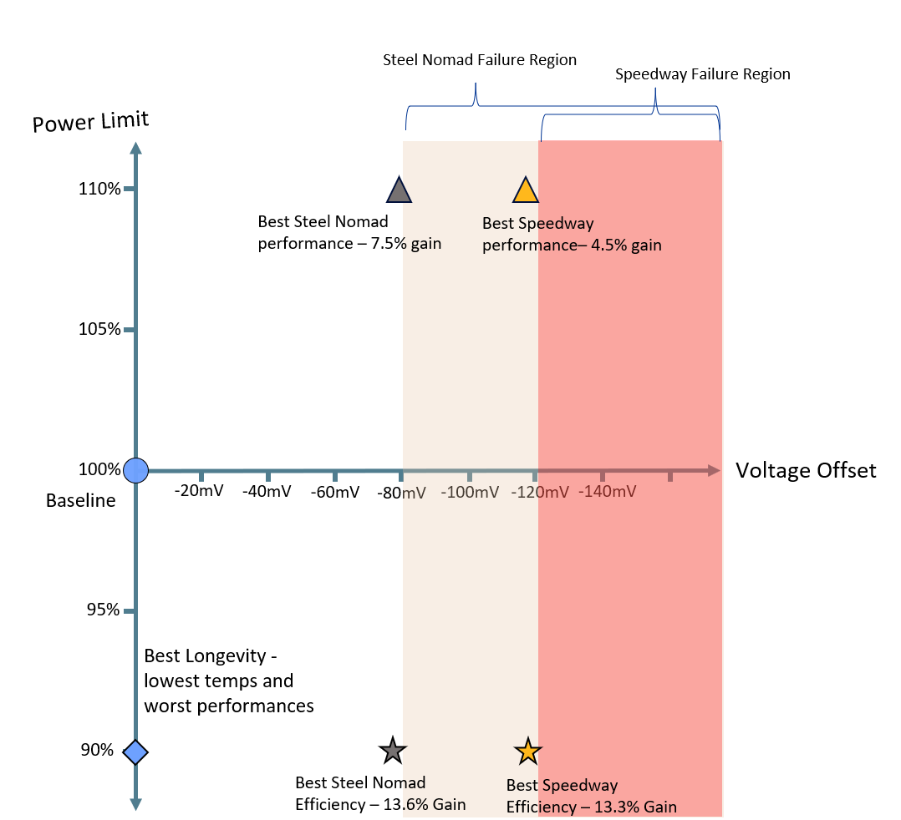

## Steel Nomad

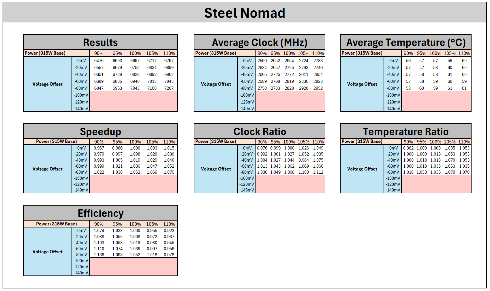

  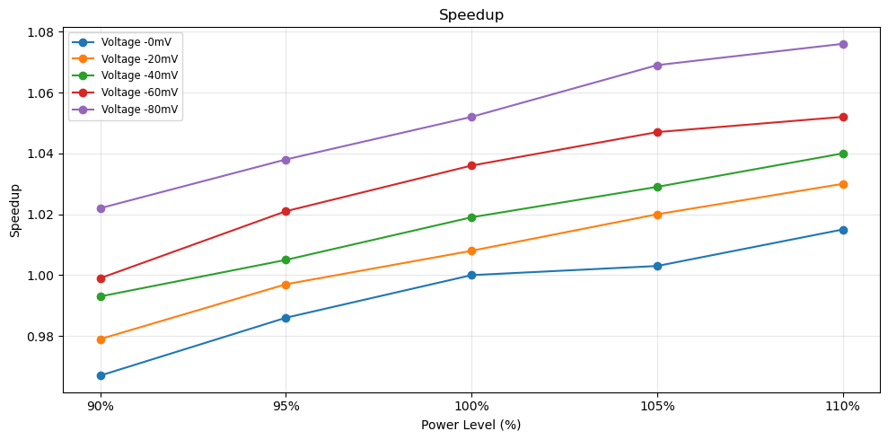
  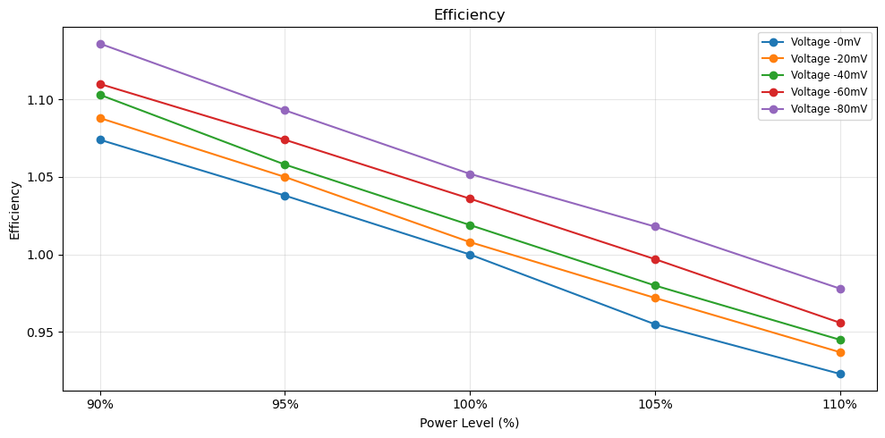
  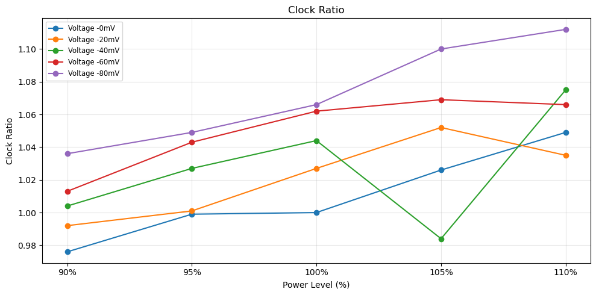
  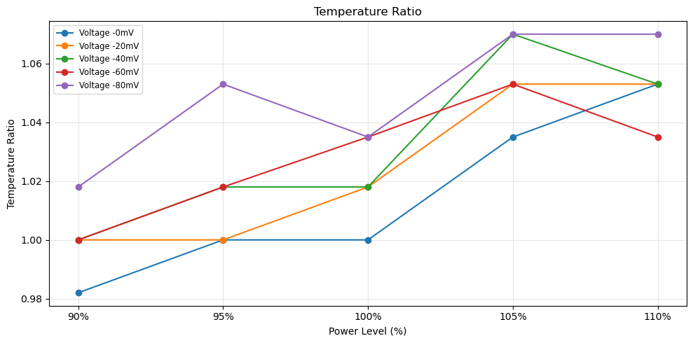

## Speedway

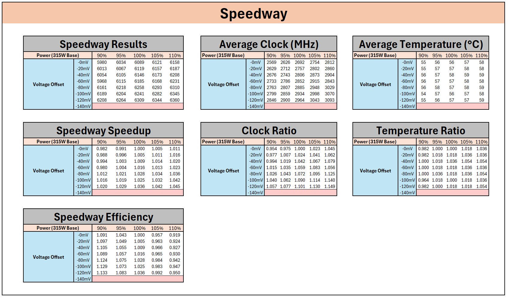

  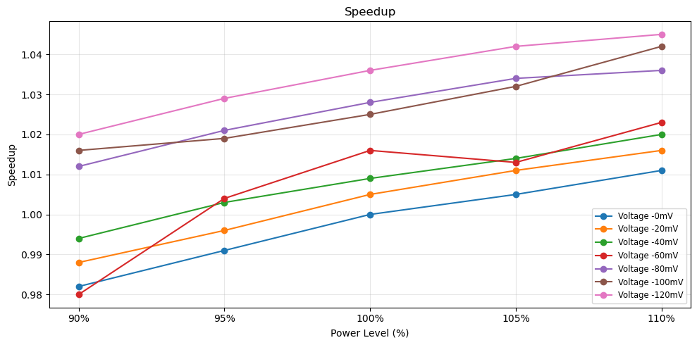
  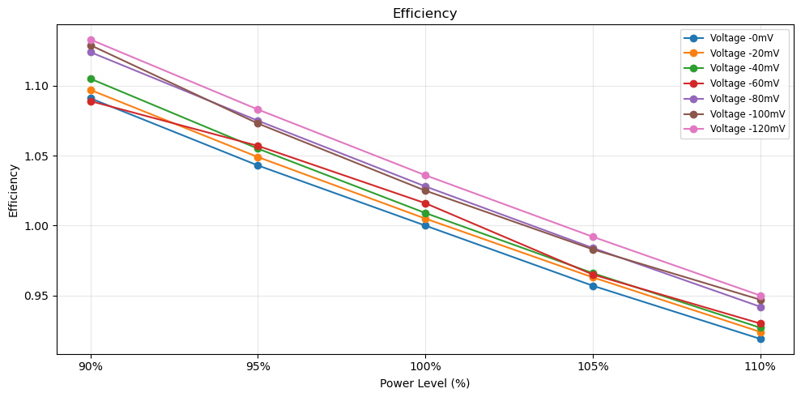
  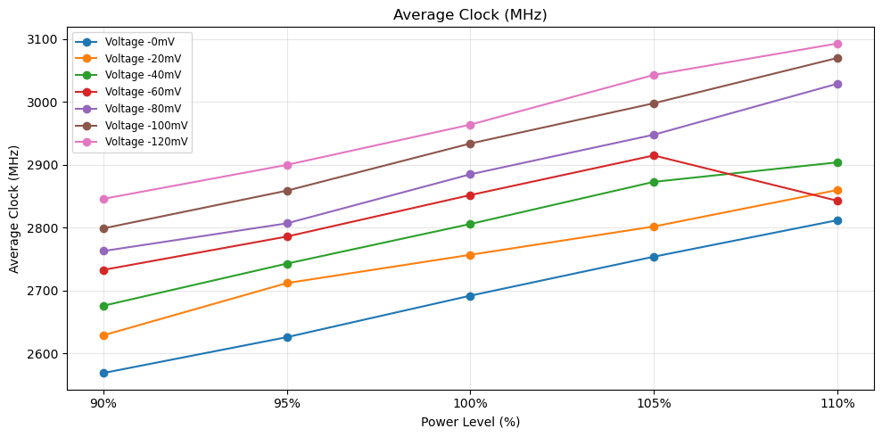
  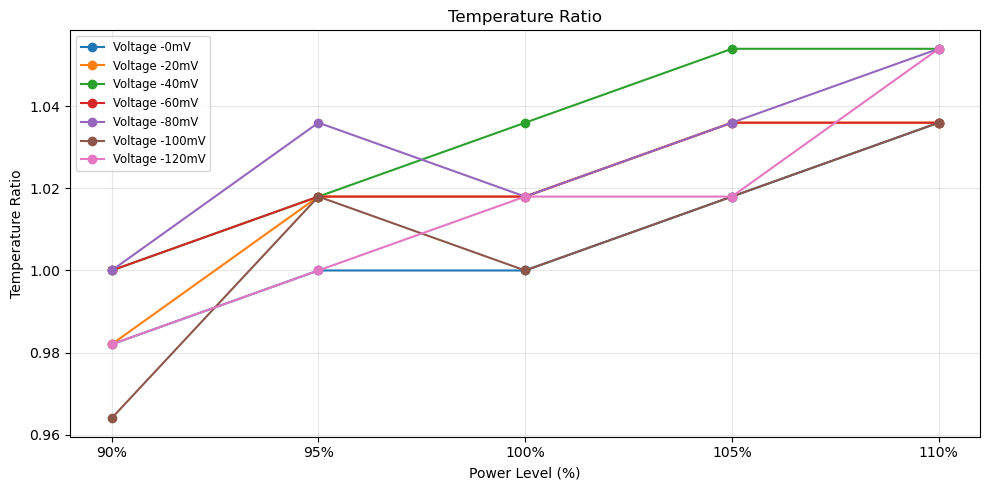

